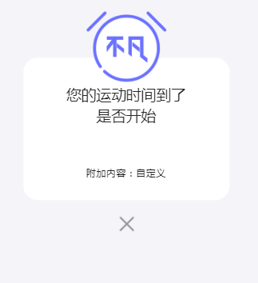

   

# UI 组件文档

## 更新日志

Now Version：1.0.2

Time: 2019-3-17

图标说明：

  新增加   修改    删除

**V-1.0.2**

> ​	time: 2019-3-17
>
>  增加 Swich 和 VideioPlayer 组件 

**V-1.0.1**

> ​	time: 2019-3-15
>
> 组件更新:
>
>     Button  增加 自定义样式  和点击事件

**V-1.0.0**

> time: 2019-3-13 
>
> 组件更新:
>
> 1.   Icon 
>
> 增加 事件绑定的功能  
>
> 增加  标签渲染功能 
>
> 增加  属性描述功能
>
> 2.   Container X  增加    oflex属性 实现Felx布局的功能
>
> 3.     Header         
>
>    修改   属性icon  默认值 为自动渲染 箭头图标  
>
>    增加   属性fixed 定位 脱离文档流
>
> 
>
> tip：增量更新 
>
> 影响：
>
> **Header 组件** **无icon**渲染的 请修改！


## PopupBox提示框

功能：弹出提示框，显示提示文字，有以下默认值

- 宽度：2.9rem = 290px

- 边框圆角：20px

- 背景颜色：白色

- 屏幕覆盖：黑色（透明度60%）

- 定位：屏幕居中

- 提示文字：21px #272727 300;

- 参数含义

  | 字段      | 功能               | 值           |
  | --------- | ------------------ | ------------ |
  | isShow    | 设置弹出框是否显示 | 布尔值       |
  | height    | 设置弹出框高度     | 整数值Number |
  | msg       | 设置提示信息       | 字符串       |
  | alarmHead | 是否显示提醒头图片 | 布尔         |

### use

```javascript
    import {PopupBox} from 'ui/popupbox/'
    <PopupBox 
    isShow={true} 
    height={200} 
    msg="您的运动时间到了是否开始"
    alarmHead={true}
    >
    附加内容：自定义
    </PopupBox>
```

* 样式

  


## Container  外包围

### Use

```javascript
 import {Container} from 'layout/container/'
	<Container 
            bg='true'   
            padding='.1rem .1rem .1rem .1rem'
     >
       附加内容：自定义
     </Container>

	
```

### ContainerX

```JSX
import { ContainerX } from 'layout/container';
<ContainerX
             obg='true'
             bg="#fff"
             padding="0rem .08rem"
             oheight='100%'
             height='6.38rem'
             scrolly='true'
            //  flex='true'
             header={
               <Header
               leftContent="运动"
               icon={<Icon type='left' width='.11rem'></Icon>}
               >
               </Header>
             }
            >
                附加内容：自定义
            
            </ContainerX>
```

### Demo

#### 定制头部ContainerX 的背景头部

> 定制头部ContainerX 的背景头部
>
>   多container 嵌套使用

```jsx
<Container padding='0' >
            <ContainerX
                oheight="3.74rem"
                obg={`url('${back}') 0 0/100% 3.74rem no-repeat`}
                header={
                   <Header

                    leftContent='泡沫轴上背部放松'
                    leftStyled='flex:2.4'
                    ></Header>
                }
            >
            </ContainerX>
            <Container>

            </Container>
</Container>
```


### Api

| 属性    | 说明     | 类型        | 默认值   |
| ------- | -------- | ----------- | -------- |
| bg      | 背景色   | string      | 无       |
| padding | 内边距   | string      | 0 .15rem |
| height  |          |             |          |
|         |          |             | 无       |
| flex    | flex布局 | true\|fasle | 无       |
|         |          |             |          |


### Api ContainerX

> ContainerX 支持内部Container的所有API的同时增加以下API

| 属性    | 说明                                               | 类型           | 默认值 |
| ------- | -------------------------------------------------- | -------------- | ------ |
| obg     | 外层CSS-background 支持 true 为默认的渐变背景      | ‘true’\|String | 无     |
| oheight | 外层CSS-height                                     | String         | 无     |
| scrolly | 外层是否开启scrolly                                | ‘true’         | 无     |
| flex    | 外层是否开启flex  true 时flex 方向为纵向 否则 横向 | String         | 无     |
| header  | 外层顶部渲染                                       | ObjectDom      | 无     |
| footer  | 外层底部部渲染                                     | ObjectDom      | 无     |
| oflex   | 外层flex布局 可布置header\|footer\|container使用   | true\|fasle    | 无     |
|         |                                                    |                |        |


## TabBar

- 除运动按钮外四个图标会进行路由跳转并高亮

- 运动按钮点击出现遮罩层（透明度90%），再次点击遮罩层消失

- 引入组件后，写在组件里的内容会显示在遮罩层上（仅供运动模块使用）


```javascript
	import {Tabbar} from 'ui/tabbar/'
	<Tarbar>运动选项</Tarbar>
```

* 样式

  


## Button

- 功能：项目所需按钮的样式，有以下默认值

  - 默认背景色
  - 默认高度：.4rem ,宽度：1.15rem
  - 默认字体白色，17px
  - 默认圆弧50%
  - 默认字体大小：.17rem

- 用法示例

  ```javascript
  import Button from 'ui/button/Button';
  //参数都是可选参数
  <Button 
  width="100"
  bg="gradual"
  rightAngle="right"
  height="50"
  fontSize="14"
  color="#fff"
  bindClick={()=>this.handleClickGoNext()}
  customStyle="position:absolute;left:10px;"
  >111</Button>
  ```

- 参数含义

  | 字段       | 功能             | 值                 |
  | ---------- | ---------------- | ------------------ |
  | width      | 设置按钮宽度     | 单位px，整数       |
  | bg         | 设置按钮背景颜色 | gradual/blue/black/white |
  | rightAngle | 设置按钮的直角   | left/right         |
  | fontSize   | 设置按钮字体的大小| 单位px,整数         |
  | height | 设置按钮高度 | 单位px，整数 |
  | color | 设置字体颜色 | 默认#fff |
  | bindClick | 添加点击事件 | 函数 |
  | customStyle | 添加自定义的样式 | 字符串类型的值 |

- 样式

  


## Icon  小图标

### Use


```javascript
	import {Icon,IconHoc} from 'ui/icon'
	//支持导出控件 和hoc 函数生成 Icon组件
	<Icon type='left' width='.11rem' ></Icon>      
```

### Demo


#### Icon 使用内置图标

```jsx
import {Icon,IconHoc} from 'ui/icon'
//设置type 详细的icon内置 见`Type内置图标`
	<Icon type='share_2x'></Icon>
	
```


####  Hoc 用法 方法生成Icon

```jsx
import {Icon,IconHoc} from 'ui/icon'
    const Icon= IconHoc({
        type:'share_2x',
        width='.19rem' 
    })
	<Icon></Icon>
```


#### 自定义图标属性

> icon 的`img`属性可以设置具体图片

```js
 //2自定义图片
    import down from 'images/icon/down.png';
	<Icon img={down}> </Icon>
    
```


#### 绑定事件和改变渲染标签

> 当icon需要改变   渲染标签  使用`tag` 属性
>
> 当icon需要绑定事件 使用React 正常的事件机制
>
> 当icon需要增加 html 属性的值 使用 `attrs`来增加属性


| 属性           | 说明                    | 类型   | 默认值 |
| -------------- | ----------------------- | ------ | ------ |
| width          | 设置宽                  | String | .19rem |
| height         | 设置高                  | String | .19rem |
| img            | 自定义img/导入路径      | String | .19rem |
| **type**       | 内置图标                | String | 无     |
| padding        | 设置padding             | String | 0      |
| border         | 设置border              | String | 0      |
| radius         | 设置圆角                | String | 0      |
| margin         | 设置margin              | String | 0      |
| **tag**  :new: | 设置渲染标签            | String | span   |
| attrs:new:     | 设置渲染属性            | object | 无     |
| 绑定事件:new:  | React 事件机制 已经支持 |        |        |
|                |                         |        |        |


### Type 内置图标

| 内置图标              |                                                              |      |      |      |      |
| --------------------- | ------------------------------------------------------------ | ---- | ---- | ---- | ---- |
| left                  | scan scan_2x                                                 |      |      |      |      |
| right                 | search search_2x                                             |      |      |      |      |
| down \| down_2x       | set set_2x                                                   |      |      |      |      |
| alert   \| alert_2x   | share share_2x                                               |      |      |      |      |
| camera\|camera_2x     | clear clear_2x       |      |      |      |      |
| dustbin\|dustbin_2x   | fire fire_2x         |      |      |      |      |
| favorite\|favorite_2x | player player_2x     |      |      |      |      |
| fly \|fly_2x          | share_black   share_black_2x |      |      |      |      |
| love\|love_2x         | strength  strength_2x |      |      |      |      |
| mail mail_2x          | strength_active   strength_active_2x |      |      |      |      |
| message message_2x    |                                                              |      |      |      |      |
| plus plus_2x          |                                                              |      |      |      |      |
| position position_2x  |                                                              |      |      |      |      |
| qrcode \|qrcode_2x    |                                                              |      |      |      |      |
|                       |                                                              |      |      |      |      |

### Icon Code


```javascript
import {Icon} from 'ui/icon'
<Icon type='favorite_2x'> </Icon>  
```


```javascript
import {Icon} from 'ui/icon'
<Icon type='fly_2x'> </Icon>  
```


```javascript
import {Icon} from 'ui/icon'
<Icon type='fly_active_2x'> </Icon>  
```


```javascript
import {Icon} from 'ui/icon'
  <Icon width='.11rem' ></Icon>
	//建议使用
```


```javascript
import {Icon} from 'ui/icon'
<Icon type='love_2x'> </Icon>  
```


```javascript
import {Icon} from 'ui/icon'
<Icon type='mail_2x'> </Icon>  
```


```javascript
import {Icon} from 'ui/icon'
<Icon type='message_2x'> </Icon>  
```


```javascript
import {Icon} from 'ui/icon'
<Icon type='plus_2x'> </Icon>  
```


```javascript
import {Icon} from 'ui/icon'
<Icon type='position_2x'> </Icon>  
```


```javascript
import {Icon} from 'ui/icon'
<Icon type='qrcode_2x'> </Icon>  
```


```javascript
import {Icon} from 'ui/icon'
<Icon type='right'> </Icon>  
```


```javascript
import {Icon} from 'ui/icon'
<Icon type='scan_2x'> </Icon>  
```


```javascript
import {Icon} from 'ui/icon'
<Icon type='search_2x'> </Icon>  
```


```javascript
import {Icon} from 'ui/icon'
<Icon type='set_2x'> </Icon>  
```


```javascript
import {Icon} from 'ui/icon'
<Icon type='share_2x'> </Icon>  
```


```javascript
import {Icon} from 'ui/icon'
<Icon type='alert_2x'> </Icon>  
```


```javascript
import {Icon} from 'ui/icon'
<Icon type='camera_2x'> </Icon>  
```


```javascript
import {Icon} from 'ui/icon'
<Icon type='down_2x'> </Icon>  
```


```javascript
import {Icon} from 'ui/icon'
<Icon type='dustbin_2x'> </Icon>  
```


```javascript
import {Icon} from 'ui/icon'
<Icon type='share_black_2x'> </Icon>  
```


```javascript
import {Icon} from 'ui/icon'
<Icon type='player_2x'> </Icon>  
```


```javascript
import {Icon} from 'ui/icon'
<Icon type='strength_2x'> </Icon>  
```


```javascript
import {Icon} from 'ui/icon'
<Icon type='fire_2x'> </Icon>  
```


```javascript
import {Icon} from 'ui/icon'
<Icon type='clear_2x'> </Icon>  
```


```javascript
import {Icon} from 'ui/icon'
<Icon type='strength_active_2x'> </Icon>  
```


## Header 头部

### use

> import {Header} from 'ui/header'
>
> import {Icon} from 'ui/icon'
>
> 
>
> ```javascript
>   import {Icon} from 'ui/icon'
>   import {Header} from 'ui/header'
> 	<Header
>             leftContent="健康轻食"
>             icon={<Icon width='.11rem' ></Icon>}
>             rightContent={<Icon type="share_2x" ></Icon>}
>             >
>             </Header>
> ```
>

### Demo Use

#### Demo 增加左内容区 fixed

> 左侧不能满足时增加左内容区  fixed定位 脱离文档流

```jsx
<Header
                    leftContent='泡沫轴上背部放松'
                    leftStyled='flex:2.4'
    				fixed 
                    ></Header>
```


### Demo

#### 扩展header的文字区域

```js
 <Header
                    leftContent='泡沫轴上背部放松'
                    leftStyled='flex:2.4'
                    fixed
                    ></Header>
```


### 全参数使用

```javascript
        <Header 
         leftContent="健康轻食"
         icon={<Icon width='.11rem' ></Icon>}
         onLeftClick={() => console.log('onLeftClick')}
         rightContent={<Icon type="share_2x" ></Icon> }
         bgColor='transparent' //导航背景色
         color='#fff' //导航文字颜色
         letftFont={{size:'.19rem',  //导航左侧文字大小 
                     color:'#fff', //导航左侧文字颜色
                     type:'bold' //导航左侧文字famlily
           }}
        rightFont={{
             size:'', //导航右侧文字大小
             color:'', //导航右侧文字颜色
             type:'' //导航右侧文字famlily
          }}
        iconRightMargin=''//导航icon的右边距
        leftStyled=''//导航左侧样式 自定义 string 添加在样式中
         rightStyled=''//导航右侧样式 自定义 string 添加在样式中 
   >Header-Demo </Header>
```


<<<<<<< HEAD
### API 

[ antd NavBar 扩展](https://mobile.ant.design/components/nav-bar-cn/#API)

| 属性                  | 说明                     | 类型              | 默认值      |
| :-------------------- | :----------------------- | :---------------- | :---------- |
| icon                  | 出现在最左边的图标占位符 | ReactNode         | -           |
| leftContent           | 导航左边内容             | any               | 无          |
| rightContent          | 导航右边内容             | any               | 无          |
| onLeftClick           | 导航左边点击回调         | (e: Object): void | 无          |
| bgColor               | 导航背景色               | string            | transparent |
| color                 | 导航文字颜色             | string            | #fff        |
| letftFont.size        | 导航右侧文字大小         | string            | .19rem      |
| letftFont.color       | 导航右侧文字颜色         | string            | #fff        |
| letftFont.type        | 航右侧文字famlily        | string            | bold        |
| rightFont导航右侧文字 | 与letftFont相同          |                   |             |
| iconRightMargin       | 导航icon的右边距         | string            | .15rem      |
| leftStyled            | 导航左侧样式 自定义样式  | string            | 无          |
| rightStyled           | 导航右侧样式 自定义样式  | string            | 无          |
| fixed                 | fixed 定位\|有属性就生效 | null              | 无          |
=======
### API

 [ antd NavBar 扩展#](https://mobile.ant.design/components/nav-bar-cn/#API)

| 属性                  | 说明                      | 类型              | 默认值                                    |
| :-------------------- | :------------------------ | :---------------- | :---------------------------------------- |
| icon                  | 出现在最左边的图标占位符  | ReactNode         | <Icon type='left' width='.11rem' ></Icon> |
| leftContent           | 导航左边内容              | any               | 无                                        |
| rightContent          | 导航右边内容              | any               | 无                                        |
| onLeftClick           | 导航左边点击回调          | (e: Object): void | 无                                        |
| bgColor               | 导航背景色                | string            | transparent                               |
| color                 | 导航文字颜色              | string            | #fff                                      |
| letftFont.size        | 导航右侧文字大小          | string            | .19rem                                    |
| letftFont.color       | 导航右侧文字颜色          | string            | #fff                                      |
| letftFont.type        | 航右侧文字famlily         | string            | bold                                      |
| rightFont导航右侧文字 | 与letftFont相同           |                   |                                           |
| iconRightMargin       | 导航icon的右边距          | string            | .15rem                                    |
| leftStyled            | 导航左侧样式 自定义样式   | string            | 无                                        |
| rightStyled           | 导航右侧样式 自定义样式   | string            | 无                                        |
| fixed                 | fixed 布局开启 脱离文档流 |                   | 无                                        |
>>>>>>> master


## VideoPlayer 简易媒体播放器

> Ref Hook 独立组件 
>
> 不是公共组件  暂不提供使用


| 属性     | 说明                    | 类型   | 默认值 |
| -------- | ----------------------- | ------ | ------ |
| width    | 媒体宽度                | String | "100%" |
| movie    | 媒体源                  | Path   | 无     |
| preload  | 媒体缓存                | String | auto   |
| loop     | 媒体是否循环播放        | 无     | 无     |
| controls | 是否显示媒体控制器      | 无     | 无     |
| play     | 是否播放媒体 *required* | 无     | 无     |

### Use Demo

```jsx
<VideoPlayer
   movie={movie}
   play={this.state.play}
   loop
/>
```

=======
## Switch 滑动开关

在两个互斥对象进行选择，eg：选择开或关。

### Demo 示例

```html
<Switch id='switch2' checked={false} />
```

### 效果图

  

### API 参数

| 属性 | 说明 | 类型 | 默认值 |
| ---- | --- | ---- | ----- |
| checked | 是否默认选中 | Boolean | false |
| onClick | click事件触发的回调函数 | Function | 打印该元素 |

